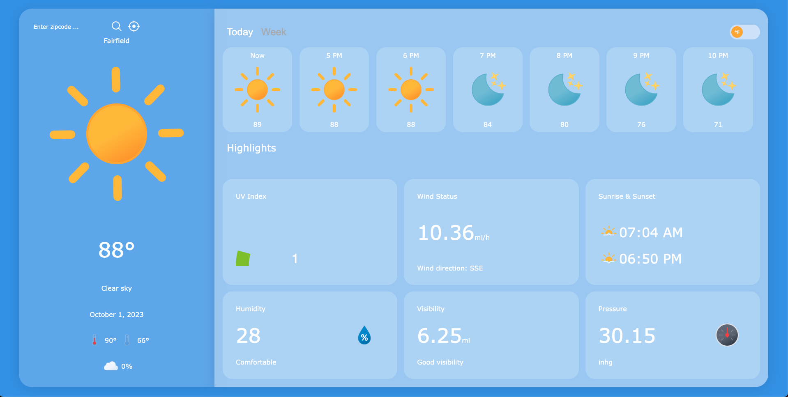
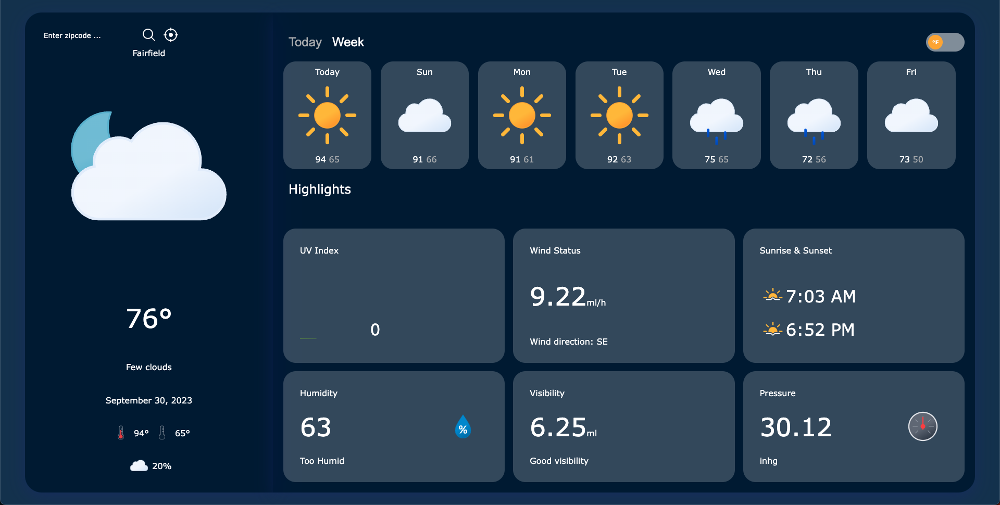

# Weather App

## Description

This is a weather application built with React that provides real-time weather information. Users can check the current weather conditions, forecast, and other related data for a specific location.

## Installation

To install and run this application locally, follow these steps:
<details>
  <summary>from GitHub</summary>
   <br/>

- Clone the repository:
```sh
  git clone https://github.com/bodibileg/weather.git
  ```
- Navigate to the project directory:
```sh
  cd weather
  ```
- Install dependencies:
```sh
  npm install
  ```
- Configure enviromental config:
```sh
  touch .env
```
```javascript
  REACT_APP_OPENWEATHERMAP_API_URL=http://api.openweathermap.org/
  REACT_APP_OPENWEATHERMAP_API_KEY=<api-key>
```
- Start the development server:
```sh
  npm start
  ```
</details>

<details>
  <summary>from Docker Image</summary>
  <br/>
  
  - pull image:
```sh
  docker pull bodibileg/weather-app:latest
  ```
  - run:
```sh
  docker run -p 3000:3000 bodibileg/weather-app:latest
  ```
  - go to http://localhost:3000/ in your browser
  - enable location access

</details>

## Feature

- **Current Weather**: Get real-time information about the current weather conditions.
- **Weather Forecast**: View the weather forecast for the upcoming hours and days.
- **Location-based**: Provide weather data based on the user's location or a specific location entered by the user.

## Technologies Used

- **React**: A JavaScript library for building user interfaces.
- **Redux**: A predictable state container for JavaScript apps.
- **Axios**: A popular JavaScript library for making HTTP requests.
- **Moment.js**: A library for parsing, validating, manipulating, and displaying dates and times.
-** Material-UI**: A popular React UI framework.
- **SCSS**: A CSS preprocessor that adds power and elegance to the basic CSS.

## Screenshots

  <br/>
  <details>
  <summary>Daytime</summary>

  

  </details>

  <br/>
  <details>
  <summary>Nighttime</summary>
  
  

  </details>

## Contributing

If you have a suggestion that would make this better, please fork the repo and create a pull request. You can also simply open an issue with the tag "enhancement".
Don't forget to give the project a star! Thanks again!

1. Fork the Project
2. Create your Feature Branch (`git checkout -b feature/AmazingFeature`)
3. Commit your Changes (`git commit -m 'Add some AmazingFeature'`)
4. Push to the Branch (`git push origin feature/AmazingFeature`)
5. Open a Pull Request

## Appreciation

I would like to express my gratitude to the following creator
-Icons designed by [Bas Milius](https://bas.dev/about) from [Meteocons](https://bas.dev/work/meteocons)

